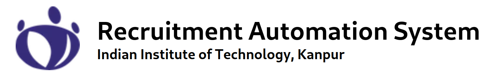
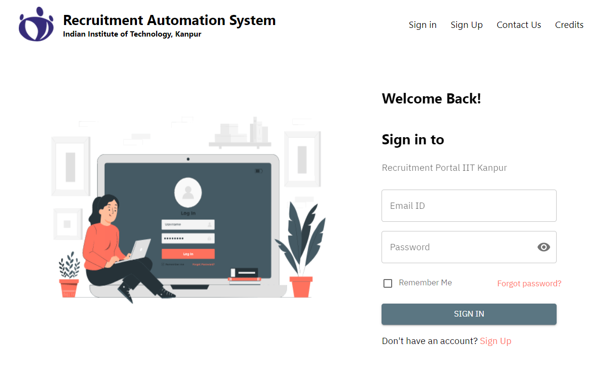

<!-- Improved compatibility of back to top link: See: https://github.com/spo-iitk/ras-backend/pull/73 -->

<a name="readme-top"></a>

<!--
*** Thanks for checking out the Best-README-Template. If you have a suggestion
*** that would make this better, please fork the repo and create a pull request
*** or simply open an issue with the tag "enhancement".
*** Don't forget to give the project a star!
*** Thanks again! Now go create something AMAZING! :D
-->

<!-- PROJECT SHIELDS -->
<!--
*** I'm using markdown "reference style" links for readability.
*** Reference links are enclosed in brackets [ ] instead of parentheses ( ).
*** See the bottom of this document for the declaration of the reference variables
*** for contributors-url, forks-url, etc. This is an optional, concise syntax you may use.
*** https://www.markdownguide.org/basic-syntax/#reference-style-links
-->

[![Contributors][contributors-shield]][contributors-url]
[![Forks][forks-shield]][forks-url]
[![Stargazers][stars-shield]][stars-url]
[![Issues][issues-shield]][issues-url]
[![LinkedIn][linkedin-shield]][linkedin-url]

<!-- PROJECT LOGO -->
<br />
<div align="center">
  <a href="https://spo.iitk.ac.in/gh/">
    
  </a>

  <h3 align="center">Recruitment Automation System</h3>

  <p align="center">
    Backend for Recruitment Automation System
    <br />
    <a href="https://placement.iitk.ac.in/"><strong>Visit the Portal »</strong></a>
    <br />
    <br />
    <!-- <a href="https://github.com/spo-iitk/ras-backend">View Demo</a> -->
    <!-- · -->
    <a href="https://github.com/spo-iitk/ras-backend/issues">Report Bug</a>
    ·
    <a href="https://github.com/spo-iitk/ras-backend/issues">Request Feature</a>
  </p>
</div>

<!-- TABLE OF CONTENTS -->
<details>
  <summary>Table of Contents</summary>
  <ol>
    <li>
      <a href="#about-the-project">About The Project</a>
      <ul>
        <li><a href="#built-with">Built With</a></li>
      </ul>
    </li>
    <li>
      <a href="#getting-started">Getting Started</a>
      <ul>
        <li><a href="#prerequisites">Prerequisites</a></li>
        <li><a href="#installation">Installation</a></li>
      </ul>
    </li>
    <li><a href="#usage">Usage</a></li>
    <li><a href="#roadmap">Roadmap</a></li>
    <li><a href="#contributing">Contributing</a></li>
    <li><a href="#license">License</a></li>
    <li><a href="#contact">Contact</a></li>
    <li><a href="#acknowledgments">Acknowledgments</a></li>
  </ol>
</details>

<!-- ABOUT THE PROJECT -->

## About The Project

[](https://placement.iitk.ac.in)

The Recruitment Automation Portal facilitate information exchange between Students, Companies, and Placement Office for smooth conduction of placement and internship drives of IIT Kanpur.

This repository contains the backend code for the portal. The frontend code can be found [here](https://github.com/spo-iitk/ras-frontend). The portal is hosted at [https://placement.iitk.ac.in](https://placement.iitk.ac.in).

The portal is built using golang and postgresql. The architecture of the portal is that of a microservice architecture. The portal is divided into multiple services, each of which is responsible for a specific task. Since the current setup is entirly on one machine, the services communicate with each other using IPC once they are shifted to distributed machines gRPC can be used. The portal uses a nginx reverse proxy to route requests to the appropriate service. :smile:

The five services are:

- Auth Service
- Student Service
- Company Service
- Recruitment Cycle Service
- Application Service

Hence five diffrent databases are used. The databases and users are created automatically using the script at `container/init.sql`. The database schema is defined in the `model.go` folder of each service.

The code for the portal exposes nine port corresponding to the nine sub services. The nginx reverse proxy is configured to route requests to the appropriate service.
The routing can be found in the `container/nginx.conf` file.

The mail service is provided by IITK mail servers. Google calender IDs to sync portal events with calender are generated from spo web team Gmail ID. The credentials are stored in the `secret.yml` file.

<p align="right">(<a href="#readme-top">back to top</a>)</p>

### Built With

Built with love :heart: by a team led by four shophomores- [credits](https://placement.iitk.ac.in/credits) This section contains major frameworks/libraries used to bootstrap your project.

- [![go][golang]][go-url]
- [![Postgres SQL][psql]][psql-url]
- [![Nginx][nginx]][nginx-url]
- [![Docker][docker]][docker-url]
- [![Gin][gin]][gin-url]
- [![Gorm][gorm]][gorm-url]

<p align="right">(<a href="#readme-top">back to top</a>)</p>

<!-- GETTING STARTED -->

## Getting Started

This is an example of how you may give instructions on setting up your project locally.
To get a local copy up and running follow these simple example steps.

### Prerequisites

This is an example of how to list things you need to use the software and how to install them.

- Google Clould Credentials and google calender ID
- Mail server credentials
- Database setup and credentials (refer `container/init.sql`)
- Go (refer [go installation](https://golang.org/doc/install))

### Installation

1. Provision all required credentials and database
2. Clone the repo
   ```sh
   git clone https://github.com/spo-iitk/ras-backend.git
   ```
3. cp `secret.yml.template` to `secret.yml` and fill in the required credentials
4. Save GCP credentials as `secret.GCPcredentials.json`
5. Install go dependencies
   ```sh
   go mod download
   ```
6. Build the project
   ```sh
   go build ./cmd/. -o ras-backend
   ```
7. Run the project
   ```sh
   ./ras-backend
   ```

<p align="right">(<a href="#readme-top">back to top</a>)</p>

## Usage

Please refer to the [Documentation](#). (Still under construction)

<p align="right">(<a href="#readme-top">back to top</a>)</p>

<!-- ROADMAP -->

## Roadmap

- [ ] Other role based access control
- [ ] Strict check on db return values per role
- [ ] Add tests
- [ ] Cache & Pagination
- [ ] Add Changelog

See the [open issues](https://github.com/spo-iitk/ras-backend/issues) for a full list of proposed features (and known issues).

<p align="right">(<a href="#readme-top">back to top</a>)</p>

<!-- CONTRIBUTING -->

## Contributing

Contributions are what make the open source community such an amazing place to learn, inspire, and create. Any contributions you make are **greatly appreciated**.

If you have a suggestion that would make this better, please fork the repo and create a pull request. You can also simply open an issue with the tag "enhancement".
Don't forget to give the project a star! Thanks again!

1. Fork the Project
2. Create your Feature Branch (`git checkout -b feature/AmazingFeature`)
3. Commit your Changes (`git commit -m 'Add some AmazingFeature'`)
4. Push to the Branch (`git push origin feature/AmazingFeature`)
5. Open a Pull Request

<p align="right">(<a href="#readme-top">back to top</a>)</p>

<!-- LICENSE -->

## License

The repository is not available for public use. In case a voilation is found, the repository will be made private and IIT Kanpur will be taking action. Please contact the maintainers for more information.

<p align="right">(<a href="#readme-top">back to top</a>)</p>

<!-- CONTACT -->

## Contact

Web heads 2022-23:

- Harshit Raj - [harshitraj.me](https://1-Harshit.github.io) - harshitr@cse.iitk.ac.in
- Abhishek Shree - [abhishekshree.me](https://abhishekshree.github.io) - shreea20@iitk.ac.in

Project Link: [https://github.com/spo-iitk/ras-backend](https://github.com/spo-iitk/ras-backend)

<p align="right">(<a href="#readme-top">back to top</a>)</p>

<!-- ACKNOWLEDGMENTS -->

<!-- ## Acknowledgments

Will be updated soon!

- [Choose an Open Source License](https://choosealicense.com)
- [GitHub Emoji Cheat Sheet](https://www.webpagefx.com/tools/emoji-cheat-sheet)
- [Malven's Flexbox Cheatsheet](https://flexbox.malven.co/)
- [Malven's Grid Cheatsheet](https://grid.malven.co/)
- [Img Shields](https://shields.io)
- [GitHub Pages](https://pages.github.com)
- [Font Awesome](https://fontawesome.com)
- [React Icons](https://react-icons.github.io/react-icons/search) -->

<p align="right">(<a href="#readme-top">back to top</a>)</p>

<!-- MARKDOWN LINKS & IMAGES -->
<!-- https://www.markdownguide.org/basic-syntax/#reference-style-links -->

[contributors-shield]: https://img.shields.io/github/contributors/spo-iitk/ras-backend.svg?style=for-the-badge
[contributors-url]: https://github.com/spo-iitk/ras-backend/graphs/contributors
[forks-shield]: https://img.shields.io/github/forks/spo-iitk/ras-backend.svg?style=for-the-badge
[forks-url]: https://github.com/spo-iitk/ras-backend/network/members
[stars-shield]: https://img.shields.io/github/stars/spo-iitk/ras-backend.svg?style=for-the-badge
[stars-url]: https://github.com/spo-iitk/ras-backend/stargazers
[issues-shield]: https://img.shields.io/github/issues/spo-iitk/ras-backend.svg?style=for-the-badge
[issues-url]: https://github.com/spo-iitk/ras-backend/issues
[linkedin-shield]: https://img.shields.io/badge/-LinkedIn-black.svg?style=for-the-badge&logo=linkedin&colorB=555
[linkedin-url]: https://www.linkedin.com/in/iitkanpurplacement
[golang]: https://img.shields.io/github/go-mod/go-version/spo-iitk/ras-backend?style=for-the-badge
[go-url]: https://golang.org/
[psql]: https://img.shields.io/badge/postgres-%23316192.svg?style=for-the-badge&logo=postgresql&logoColor=white
[psql-url]: https://www.postgresql.org/
[nginx]: https://img.shields.io/badge/nginx-%23009639.svg?style=for-the-badge&logo=nginx&logoColor=white
[nginx-url]: https://www.nginx.com/
[docker]: https://img.shields.io/badge/docker-%230db7ed.svg?style=for-the-badge&logo=docker&logoColor=white
[docker-url]: https://www.docker.com/
[gin]: https://img.shields.io/badge/gin-%23FF4088.svg?style=for-the-badge&logo=gin&logoColor=white
[gin-url]: https://gin-gonic.com/
[gorm]: https://img.shields.io/badge/gorm-%23FF4088.svg?style=for-the-badge&logo=gorm&logoColor=white
[gorm-url]: https://gorm.io/
